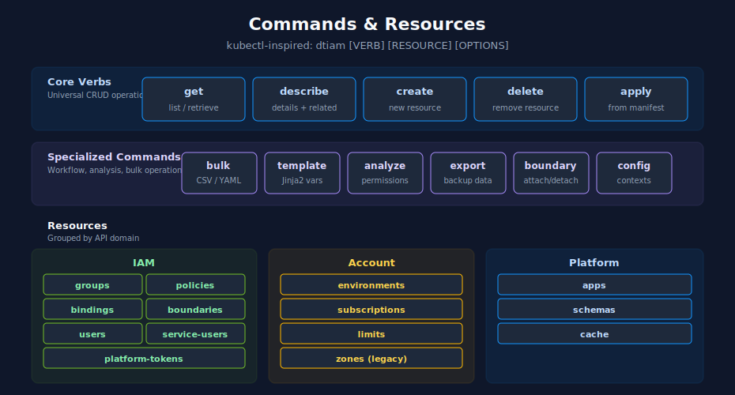
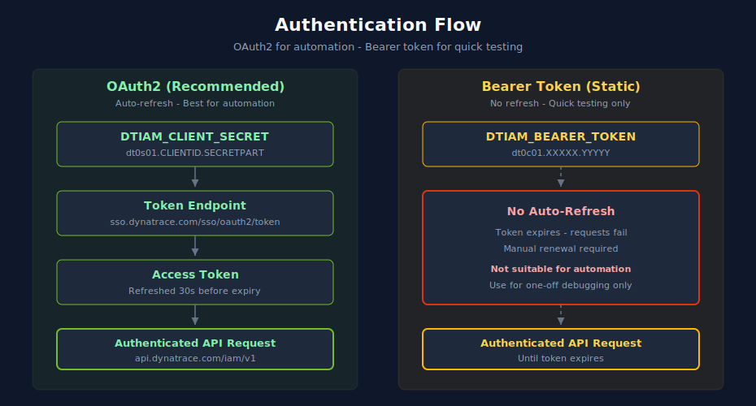

# dtiam - Dynatrace IAM CLI

> **⚠️ DISCLAIMER**: This tool is provided "as-is" without warranty. **Use at your own risk.**  This tool is an independent, community-driven project and **not produced, endorsed, or supported by Dynatrace**. The authors assume no liability for any issues arising from its use. For official Dynatrace tools and support, please visit [dynatrace.com](https://www.dynatrace.com).

A kubectl-inspired command-line interface for managing Dynatrace Identity and Access Management resources.



<!-- MARKDOWN_TABLE_ALTERNATIVE
| Layer | Items |
|-------|-------|
| Core Verbs | get, describe, create, delete, apply |
| Specialized Commands | bulk, template, analyze, export, boundary, config |
| IAM Resources | groups, policies, bindings, boundaries, users, service-users, platform-tokens |
| Account Resources | environments, subscriptions, limits, zones (legacy) |
| Platform Resources | apps, schemas, cache |
For environments where SVG does not render
-->

## Features

- **kubectl-style commands** - Familiar syntax: `get`, `describe`, `create`, `delete`, `apply`
- **Multi-context configuration** - Manage multiple Dynatrace accounts with named contexts
- **Rich output formats** - Table (default), JSON, YAML, CSV, and wide mode
- **Flexible authentication** - OAuth2 (recommended) or bearer token support
- **Bulk operations** - Process multiple resources from CSV/YAML files
- **Template system** - Jinja2-style variable substitution for manifests
- **Permissions analysis** - Calculate effective permissions for users and groups
- **Management zones** - Zone operations and group comparison *(legacy - see deprecation notice)*
- **Caching** - In-memory cache with TTL for reduced API calls

## Installation

**Quick Start** - Use the automated installation script:

### macOS / Linux
```bash
chmod +x install.sh
./install.sh
```

### Windows
```bash
install.bat
```

See [INSTALLATION.md](./INSTALLATION.md) for detailed instructions and alternative installation methods.

## Authentication

dtiam supports two authentication methods. Choose based on your use case:



<!-- MARKDOWN_TABLE_ALTERNATIVE
| Method | Input | Behavior | Best For |
|--------|-------|----------|----------|
| OAuth2 (recommended) | DTIAM_CLIENT_SECRET | Auto-refreshes access token 30s before expiry via sso.dynatrace.com | Automation, CI/CD, long-running processes |
| Bearer Token (static) | DTIAM_BEARER_TOKEN | No refresh — requests fail when token expires | Quick testing, one-off debugging only |
For environments where SVG does not render
-->

### Option 1: OAuth2 Client Credentials (Recommended)

**Best for:** Automation, scripts, long-running processes, CI/CD pipelines

**Advantages:**
- Tokens auto-refresh when expired
- Secure credential storage in config file
- Scoped permissions via OAuth2 client configuration

**Risks:**
- Client secret must be stored securely
- Requires creating an OAuth2 client in Dynatrace

```bash
# Add OAuth2 credentials (client ID auto-extracted from secret)
dtiam config set-credentials prod \
  --client-secret YOUR_CLIENT_SECRET

# Create a context
dtiam config set-context prod \
  --account-uuid YOUR_ACCOUNT_UUID \
  --credentials-ref prod

# Switch to the context
dtiam config use-context prod

# Or use environment variables (client ID is auto-extracted from secret)
export DTIAM_CLIENT_SECRET="dt0s01.XXXXX.YYYYY"
export DTIAM_ACCOUNT_UUID="abc-123-def"
```

### Option 2: Bearer Token (Static)

**Best for:** Quick testing, interactive sessions, debugging, integration with external token providers

**Advantages:**
- No OAuth2 client setup required
- Can use tokens from other systems
- Quick for one-off operations

**Risks:**
- ⚠️ **Tokens do NOT auto-refresh** - requests fail when token expires
- ⚠️ **Not suitable for automation** - requires manual token renewal
- Token expiration causes immediate failures with no recovery

```bash
# Set bearer token via environment variable
export DTIAM_BEARER_TOKEN="dt0c01.XXXXX.YYYYY..."
export DTIAM_ACCOUNT_UUID="abc-123-def"

# Run commands - token will be used until it expires
dtiam get groups
```

### Authentication Priority

When multiple authentication methods are configured, dtiam uses this priority:
1. `DTIAM_BEARER_TOKEN` + `DTIAM_ACCOUNT_UUID` (bearer token)
2. `DTIAM_CLIENT_SECRET` + `DTIAM_ACCOUNT_UUID` (OAuth2 via env, client ID auto-extracted)
3. Config file context with OAuth2 credentials

**Note:** `DTIAM_CLIENT_ID` is optional - it's automatically extracted from `DTIAM_CLIENT_SECRET` since Dynatrace secrets follow the format `dt0s01.CLIENTID.SECRETPART`.

## Quick Start

### 1. Set up credentials (OAuth2)

```bash
# Add OAuth2 credentials (client ID auto-extracted from secret)
dtiam config set-credentials prod \
  --client-secret YOUR_CLIENT_SECRET

# Create a context
dtiam config set-context prod \
  --account-uuid YOUR_ACCOUNT_UUID \
  --credentials-ref prod

# Switch to the context
dtiam config use-context prod

# Verify configuration
dtiam config view
```

### 2. List and filter resources

```bash
# List all groups
dtiam get groups

# Filter groups by name (partial match, case-insensitive)
dtiam get groups --name LOB

# List and filter policies
dtiam get policies --name Admin

# Filter users by email
dtiam get users --email @example.com

# Filter environments
dtiam get environments --name Prod
```

### 3. Get detailed information

```bash
# Describe a group (includes members and policies)
dtiam describe group "LOB5"

# Describe a policy (includes statements)
dtiam describe policy "admin-policy"

# Describe a user (includes group memberships)
dtiam describe user user@example.com
```

### 4. Create resources

```bash
# Create a group
dtiam create group --name "New Team" --description "A new team"

# Create a binding (assign policy to group)
dtiam create binding --group "New Team" --policy "viewer-policy"
```

## Commands

| Command | Description |
|---------|-------------|
| `config` | Manage configuration contexts and credentials |
| `get` | List/retrieve resources |
| `describe` | Show detailed resource information |
| `create` | Create resources |
| `delete` | Delete resources |
| `user` | User management operations |
| `service-user` | Service user (OAuth client) management |
| `platform-token` | Platform token management |
| `account` | Account limits and subscriptions |
| `bulk` | Bulk operations for multiple resources |
| `template` | Template-based resource creation |
| `zones` | Management zone operations *(legacy)* |
| `analyze` | Analyze permissions and policies |
| `export` | Export resources and data |
| `group` | Advanced group operations |
| `boundary` | Boundary attach/detach operations |
| `cache` | Cache management |

## Resources

| Resource | Description |
|----------|-------------|
| `groups` | IAM groups for organizing users |
| `policies` | Permission policies with statements |
| `users` | User accounts |
| `service-users` | Service users (OAuth clients) for automation |
| `platform-tokens` | Platform tokens for API access |
| `bindings` | Policy-to-group assignments |
| `environments` | Dynatrace environments |
| `boundaries` | Scope restrictions for bindings |
| `limits` | Account limits and quotas |
| `subscriptions` | Account subscriptions |
| `apps` | Dynatrace Apps (App Engine Registry) |

## Global Options

```bash
dtiam [OPTIONS] COMMAND

Options:
  -c, --context TEXT    Override the current context
  -o, --output FORMAT   Output format: table, json, yaml, csv, wide
  -v, --verbose         Enable verbose/debug output
  --plain               Plain output mode (no colors, no prompts)
  --dry-run             Preview changes without applying them
  -V, --version         Show version and exit
  --help                Show help and exit
```

## Filtering Resources

All `get` commands support **partial text matching** via filter options. Filters are:
- **Case-insensitive** - `--name prod` matches "Production", "NonProd", "prod-test"
- **Substring match** - `--name LOB` matches "LOB5", "LOB6", "MyLOBTeam"

### Filter Options by Resource

| Command | Filter Option | Example |
|---------|---------------|---------|
| `get groups` | `--name` | `dtiam get groups --name LOB` |
| `get users` | `--email` | `dtiam get users --email @example.com` |
| `get policies` | `--name` | `dtiam get policies --name Admin` |
| `get boundaries` | `--name` | `dtiam get boundaries --name Prod` |
| `get environments` | `--name` | `dtiam get environments --name Prod` |
| `get apps` | `--name` | `dtiam get apps --name dashboard -e ENV_ID` |
| `get schemas` | `--name` | `dtiam get schemas --name alerting -e ENV_ID` |
| `get service-users` | `--name` | `dtiam get service-users --name pipeline` |

### Filter Examples

```bash
# Find all groups containing "LOB" in their name
dtiam get groups --name LOB

# Find users with emails from a specific domain
dtiam get users --email @dynatrace.com

# Find production-related environments
dtiam get environments --name Prod

# Find admin policies
dtiam get policies --name admin

# Combine with output formats
dtiam get groups --name LOB -o json
dtiam get policies --name User -o yaml
```

### Identifier vs Filter

- **Identifier (positional argument)**: Exact match for UUID or name
  ```bash
  dtiam get groups "LOB5"           # Exact match - returns LOB5 or error
  ```
- **Filter option**: Partial match across all results
  ```bash
  dtiam get groups --name LOB       # Partial match - returns LOB5, LOB6, LOB7, etc.
  ```

## Configuration

Configuration is stored at `~/.config/dtiam/config` (XDG Base Directory compliant).

```yaml
api-version: v1
kind: Config
current-context: production
contexts:
  - name: production
    context:
      account-uuid: abc-123-def
      credentials-ref: prod-creds
  - name: development
    context:
      account-uuid: xyz-789-uvw
      credentials-ref: dev-creds
credentials:
  - name: prod-creds
    credential:
      client-id: dt0s01.XXXXX
      client-secret: dt0s01.XXXXX.YYYYY
preferences:
  output: table
```

## Examples

The `examples/` directory contains sample configurations, scripts, and templates:

```
examples/
├── auth/           # Authentication configuration (.env.example)
├── bulk/           # Bulk operation sample files (CSV/YAML)
├── groups/         # Group configuration examples
├── policies/       # Policy examples with common patterns
├── templates/      # Reusable templates for the template system
└── scripts/        # Shell scripts for validation and workflows
```

### Quick Start with Examples

```bash
# Set up authentication from example
cp examples/auth/.env.example .env
nano .env  # Add your credentials
source .env

# Run lifecycle validation (dry-run)
bash examples/scripts/example_cli_lifecycle.sh

# View common workflow examples
bash examples/scripts/example_common_workflows.sh
```

### Bulk Operations

```bash
# Add multiple users to a group from CSV
dtiam bulk add-users-to-group --file examples/bulk/sample_users.csv --group "LOB5"

# Create multiple groups from YAML
dtiam bulk create-groups --file examples/bulk/sample_groups.yaml

# Create multiple bindings from YAML
dtiam bulk create-bindings --file examples/bulk/sample_bindings.yaml

# Create groups with policies and bindings from CSV (all-in-one)
dtiam bulk create-groups-with-policies --file examples/bulk/sample_bulk_groups.csv
```

### Template System

```bash
# List available templates
dtiam template list

# Render a template with variables
dtiam template render team-setup \
  --var team_name="LOB5" \
  --var policy_level="admin"

# Apply rendered template
dtiam template apply team-setup \
  --var team_name="LOB5" \
  --var policy_level="admin"
```

### Permissions Analysis

```bash
# Get effective permissions for a user
dtiam analyze user-permissions user@example.com

# Get effective permissions for a group
dtiam analyze group-permissions "LOB5"

# Generate permissions matrix
dtiam analyze permissions-matrix -o json > matrix.json
```

### Export

```bash
# Export everything
dtiam export all --output-dir ./backup

# Export specific group with dependencies
dtiam export group "LOB5" --include-policies --include-members
```

### Management Zones (Legacy)

> **DEPRECATION NOTICE:** Management Zone features are provided for legacy purposes only and will be removed in a future release. Dynatrace is transitioning away from management zones in favor of other access control mechanisms.

```bash
# List all zones
dtiam zones list

# Compare zones with groups
dtiam zones compare-groups
```

### Cache Management

```bash
# View cache statistics
dtiam cache stats

# Clear expired entries
dtiam cache clear --expired-only

# Clear all cache
dtiam cache clear --force
```

## Documentation

- [Quick Start Guide](docs/QUICK_START.md) - Detailed getting started guide
- [Command Reference](docs/COMMANDS.md) - Full command documentation
- [Architecture](docs/ARCHITECTURE.md) - Technical design and implementation
- [API Reference](docs/API_REFERENCE.md) - Programmatic usage
- [Examples](examples/README.md) - Sample configurations and scripts

## Required OAuth2 Scopes

Your OAuth2 client needs specific scopes for each operation. Create your client at:
**Account Management → Identity & access management → OAuth clients**

### Scope Reference by Command

| Command | Operation | Required Scopes |
|---------|-----------|-----------------|
| **Groups** | | |
| `get groups` | List/get groups | `account-idm-read` |
| `create group` | Create group | `account-idm-write` |
| `delete group` | Delete group | `account-idm-write` |
| `group clone` | Clone group | `account-idm-read`, `account-idm-write` |
| **Users** | | |
| `get users` | List/get users | `account-idm-read` |
| `user create` | Create user | `account-idm-write` |
| `user delete` | Delete user | `account-idm-write` |
| `user add-to-group` | Add to group | `account-idm-write` |
| `user remove-from-group` | Remove from group | `account-idm-write` |
| **Service Users** | | |
| `get service-users` | List service users | `account-idm-read` |
| `create service-user` | Create service user | `account-idm-write` |
| `service-user update` | Update service user | `account-idm-write` |
| `delete service-user` | Delete service user | `account-idm-write` |
| **Platform Tokens** | | |
| `get platform-tokens` | List tokens | `platform-token:tokens:manage` |
| `create platform-token` | Generate token | `platform-token:tokens:manage` |
| `delete platform-token` | Delete token | `platform-token:tokens:manage` |
| **Policies** | | |
| `get policies` | List/get policies | `iam-policies-management` or `iam:policies:read` |
| `create policy` | Create policy | `iam-policies-management` or `iam:policies:write` |
| `delete policy` | Delete policy | `iam-policies-management` or `iam:policies:write` |
| **Bindings** | | |
| `get bindings` | List bindings | `iam-policies-management` or `iam:bindings:read` |
| `create binding` | Create binding | `iam-policies-management` or `iam:bindings:write` |
| `delete binding` | Delete binding | `iam-policies-management` or `iam:bindings:write` |
| **Boundaries** | | |
| `get boundaries` | List/get boundaries | `iam-policies-management` or `iam:boundaries:read` |
| `create boundary` | Create boundary | `iam-policies-management` or `iam:boundaries:write` |
| `delete boundary` | Delete boundary | `iam-policies-management` or `iam:boundaries:write` |
| `boundary attach/detach` | Modify bindings | `iam-policies-management` or `iam:bindings:write` |
| **Analysis** | | |
| `analyze effective-user` | Effective permissions | `iam:effective-permissions:read` |
| `analyze effective-group` | Effective permissions | `iam:effective-permissions:read` |
| **Account** | | |
| `account limits` | Account limits | `account-idm-read` |
| `account subscriptions` | Subscriptions | Bearer token (auto) |
| **Environments** | | |
| `get environments` | List environments | `account-env-read` |
| `zones list` | Management zones | `account-env-read` + `DTIAM_ENVIRONMENT_TOKEN` |
| **Apps** | | |
| `get apps` | List/get apps | `app-engine:apps:run` |
| **Schemas** | | |
| `get schemas` | List/get schemas | `DTIAM_ENVIRONMENT_TOKEN` with `settings.read` |

### Recommended Scope Sets

**Read-Only Access:**
```
account-idm-read
account-env-read
iam:policies:read
iam:bindings:read
iam:boundaries:read
iam:effective-permissions:read
app-engine:apps:run
```

**Full IAM Management:**
```
account-idm-read
account-idm-write
account-env-read
iam-policies-management
iam:effective-permissions:read
app-engine:apps:run
```

### Detecting Missing Scopes

When a required scope is missing, dtiam will return a **Permission denied** error. The error message indicates which operation failed but doesn't specify the missing scope directly (this is a Dynatrace API limitation).

**Common permission errors and their causes:**

| Error Message | Likely Missing Scope |
|---------------|---------------------|
| `Permission denied for list on groups` | `account-idm-read` |
| `Permission denied for create on groups` | `account-idm-write` |
| `Permission denied for list on policies` | `iam-policies-management` or `iam:policies:read` |
| `Permission denied for list on bindings` | `iam-policies-management` or `iam:bindings:read` |
| `Permission denied for list on apps` | `app-engine:apps:run` |
| `Request failed: 403 Forbidden` | Check scopes for the specific resource |

**To debug scope issues:**
1. Run with verbose mode: `dtiam -v get groups`
2. Check your OAuth2 client configuration in Dynatrace Account Management
3. Verify the client has the required scopes listed in the table above

## Environment Variables

| Variable | Description |
|----------|-------------|
| `DTIAM_BEARER_TOKEN` | Static bearer token (alternative to OAuth2) |
| `DTIAM_CLIENT_ID` | OAuth2 client ID (optional - auto-extracted from secret) |
| `DTIAM_CLIENT_SECRET` | OAuth2 client secret (format: dt0s01.CLIENTID.SECRET) |
| `DTIAM_ACCOUNT_UUID` | Dynatrace account UUID |
| `DTIAM_CONTEXT` | Override current context name |
| `DTIAM_OUTPUT` | Default output format |
| `DTIAM_VERBOSE` | Enable verbose mode |
| `DTIAM_API_URL` | Custom IAM API base URL (for testing or different regions) |

## Requirements

- Python 3.10+
- Dynatrace Account with API access
- Authentication: OAuth2 client credentials (recommended) OR bearer token

## Disclaimer

**USE AT YOUR OWN RISK.** This tool is provided "as-is" without any warranty of any kind, express or implied. The authors and contributors are not responsible for any damages or data loss that may result from using this tool.

**NOT PRODUCED BY DYNATRACE.** This is an independent, community-developed tool. It is not produced, endorsed, maintained, or supported by Dynatrace. For official Dynatrace products and support, visit [dynatrace.com](https://www.dynatrace.com).

**NO SUPPORT PROVIDED.** This tool is provided without support. Issues may be reported via GitHub, but there is no guarantee of response or resolution.

## License

MIT License - see LICENSE file for details.
