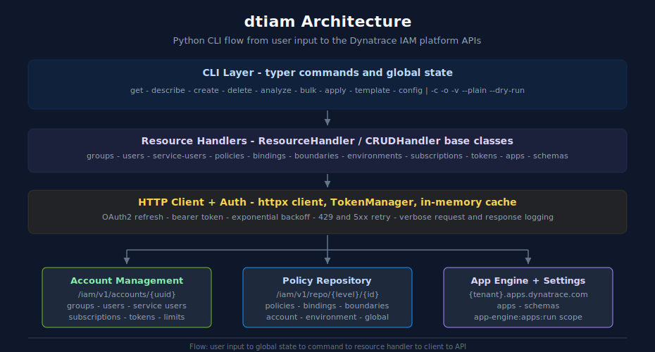

# Architecture

> **⚠️ DISCLAIMER**: This tool is provided "as-is" without warranty. **Use at your own risk.**  This tool is an independent, community-driven project and **not produced, endorsed, or supported by Dynatrace**. The authors assume no liability for any issues arising from its use.

Technical design and implementation details for dtiam.

## Overview

dtiam is a kubectl-inspired CLI for managing Dynatrace Identity and Access Management resources. It follows architectural patterns from the Python-dtctl project, using modern Python tooling and best practices.



<!-- MARKDOWN_TABLE_ALTERNATIVE
| Layer | Responsibility | Key Components |
|-------|----------------|----------------|
| CLI | Parse user input, hold global state | typer app, `get` / `describe` / `create` / `delete` / `analyze` / `bulk` / `apply` / `template` / `config`, flags `-c -o -v --plain --dry-run` |
| Resource Handlers | Map verbs to REST calls, normalize errors | `ResourceHandler` / `CRUDHandler` base classes + typed implementations for groups, users, service-users, policies, bindings, boundaries, environments, subscriptions, tokens, apps, schemas |
| HTTP Client + Auth | Sign, retry, and log requests | httpx client, `TokenManager` (OAuth2 refresh), bearer-token path, exponential backoff on 429/5xx, in-memory cache |
| APIs | Dynatrace platform surfaces | Account Management (`/iam/v1/accounts/{uuid}`), Policy Repository (`/iam/v1/repo/{level}/{id}`), App Engine + Settings (`{tenant}.apps.dynatrace.com`) |
For environments where SVG does not render
-->

## Technology Stack

| Component | Library | Purpose |
|-----------|---------|---------|
| CLI Framework | typer >= 0.9.0 | Modern CLI with type hints, auto-completion |
| HTTP Client | httpx >= 0.27.0 | Async-capable HTTP with connection pooling |
| Validation | pydantic >= 2.0 | Configuration and model validation |
| Output | rich >= 13.0 | Tables, colors, progress bars |
| Config Storage | platformdirs >= 4.0 | XDG Base Directory support |
| YAML | pyyaml >= 6.0 | Configuration and manifest parsing |

## Project Structure

```
src/dtiam/
├── __init__.py              # Package version
├── cli.py                   # Main Typer app, global state, entry points
├── config.py                # Pydantic config with multi-context support
├── client.py                # httpx client with OAuth2 + retry logic
├── output.py                # Rich formatters (table/json/yaml/csv)
│
├── commands/                # CLI command groups
│   ├── __init__.py
│   ├── config.py            # config set-context, use-context, view
│   ├── get.py               # get groups, policies, users, bindings
│   ├── describe.py          # describe group, policy, user (detailed)
│   ├── create.py            # create group, policy, binding
│   ├── delete.py            # delete group, policy, binding
│   ├── user.py              # User management operations
│   ├── service_user.py      # Service user (OAuth client) management
│   ├── account.py           # Account limits and subscriptions
│   ├── bulk.py              # Bulk operations from files
│   ├── template.py          # Template-based resource creation
│   ├── zones.py             # Management zone operations (legacy - will be removed)
│   ├── analyze.py           # Permissions analysis
│   ├── export.py            # Export operations
│   ├── group.py             # Advanced group operations
│   ├── boundary.py          # Boundary attach/detach
│   └── cache.py             # Cache management
│
├── resources/               # Resource handlers (API logic)
│   ├── __init__.py
│   ├── base.py              # ResourceHandler ABC, CRUDHandler
│   ├── groups.py            # GroupHandler
│   ├── policies.py          # PolicyHandler
│   ├── users.py             # UserHandler
│   ├── service_users.py     # ServiceUserHandler
│   ├── bindings.py          # BindingHandler
│   ├── boundaries.py        # BoundaryHandler
│   ├── environments.py      # EnvironmentHandler
│   ├── zones.py             # ZoneHandler (legacy - will be removed)
│   ├── limits.py            # AccountLimitsHandler
│   ├── subscriptions.py     # SubscriptionHandler
│   └── apps.py              # AppHandler (App Engine Registry)
│
└── utils/
    ├── __init__.py
    ├── auth.py              # OAuth2 token management
    ├── resolver.py          # Name-to-UUID resolution
    ├── templates.py         # Template rendering (Jinja2-style)
    ├── permissions.py       # Effective permissions calculation
    └── cache.py             # In-memory caching with TTL
```

## Core Components

### CLI Entry Point (`cli.py`)

The main entry point uses Typer to create a hierarchical command structure:

```python
app = typer.Typer(
    name="dtiam",
    help="A kubectl-inspired CLI for Dynatrace IAM.",
    add_completion=True,
    no_args_is_help=True,
    rich_markup_mode="rich",
)

# Global state for shared options
class State:
    context: str | None = None
    output: OutputFormat = OutputFormat.TABLE
    verbose: bool = False
    plain: bool = False
    dry_run: bool = False

state = State()
```

Commands access global state via the module-level `state` object:

```python
from dtiam.cli import state

def some_command():
    if state.dry_run:
        console.print("Dry-run mode...")
```

### Configuration System (`config.py`)

Configuration follows the kubectl config pattern with Pydantic models:

```python
class Config(BaseModel):
    api_version: str = Field(default="v1", alias="api-version")
    kind: str = Field(default="Config")
    current_context: str = Field(default="", alias="current-context")
    contexts: list[NamedContext] = Field(default_factory=list)
    credentials: list[NamedCredential] = Field(default_factory=list)
    preferences: Preferences = Field(default_factory=Preferences)
```

**Storage Location:** `~/.config/dtiam/config` (XDG Base Directory compliant)

**Environment Variable Overrides:**
| Variable | Description |
|----------|-------------|
| `DTIAM_CONTEXT` | Override current context |
| `DTIAM_OUTPUT` | Default output format |
| `DTIAM_VERBOSE` | Enable verbose mode |
| `DTIAM_CLIENT_ID` | OAuth2 client ID |
| `DTIAM_CLIENT_SECRET` | OAuth2 client secret |
| `DTIAM_ACCOUNT_UUID` | Account UUID |

### HTTP Client (`client.py`)

The client provides:
- OAuth2 authentication with automatic token refresh
- Retry with exponential backoff for transient errors
- Rate limit handling (429 responses with Retry-After)
- Verbose logging for debugging

```python
class Client:
    def __init__(
        self,
        account_uuid: str,
        token_manager: TokenManager,
        timeout: float = 30.0,
        retry_config: RetryConfig | None = None,
        verbose: bool = False,
    ):
        self.base_url = f"{IAM_API_BASE}/accounts/{account_uuid}"
        self._client = httpx.Client(
            timeout=timeout,
            headers={
                "Content-Type": "application/json",
                "User-Agent": "dtiam/3.0.0",
            },
        )

    def request(self, method: str, path: str, **kwargs) -> httpx.Response:
        # Automatic retry with exponential backoff
        for attempt in range(self.retry_config.max_retries + 1):
            headers = {**self._get_auth_headers(), **kwargs.pop("headers", {})}
            response = self._client.request(method, url, headers=headers, **kwargs)

            if response.is_success:
                return response

            if not self._should_retry(response.status_code):
                raise APIError(...)

            delay = self._get_retry_delay(attempt, response)
            time.sleep(delay)
```

**Retry Configuration:**
- Default retries: 3
- Retry status codes: 429, 500, 502, 503, 504
- Initial delay: 1.0 seconds
- Max delay: 10.0 seconds
- Exponential base: 2.0

### Resource Handlers (`resources/`)

Resource handlers follow a consistent pattern with a base class:

```python
class ResourceHandler(ABC, Generic[T]):
    def __init__(self, client: Client):
        self.client = client

    @property
    @abstractmethod
    def resource_name(self) -> str:
        """Human-readable resource name."""
        pass

    @property
    @abstractmethod
    def api_path(self) -> str:
        """Base API path for this resource."""
        pass

class CRUDHandler(ResourceHandler[T]):
    def list(self, **params) -> list[dict]:
        response = self.client.get(self.api_path, params=params)
        return response.json().get(self.list_key, [])

    def get(self, resource_id: str) -> dict:
        response = self.client.get(f"{self.api_path}/{resource_id}")
        return response.json()

    def create(self, data: dict) -> dict:
        response = self.client.post(self.api_path, json=data)
        return response.json()

    def update(self, resource_id: str, data: dict) -> dict:
        response = self.client.put(f"{self.api_path}/{resource_id}", json=data)
        return response.json()

    def delete(self, resource_id: str) -> bool:
        self.client.delete(f"{self.api_path}/{resource_id}")
        return True

    def get_by_name(self, name: str) -> dict | None:
        for item in self.list():
            if item.get("name") == name:
                return item
        return None
```

Each resource handler implements additional operations specific to that resource type.

### Output Formatting (`output.py`)

The output system uses a strategy pattern:

```python
class OutputFormat(str, Enum):
    TABLE = "table"
    WIDE = "wide"
    JSON = "json"
    YAML = "yaml"
    CSV = "csv"
    PLAIN = "plain"

class Formatter(ABC):
    @abstractmethod
    def format(self, data: Any, columns: list[Column] | None = None) -> str:
        pass

class Printer:
    def __init__(self, format: OutputFormat, plain: bool = False):
        self._formatters = {
            OutputFormat.TABLE: TableFormatter(wide=False, plain=plain),
            OutputFormat.WIDE: TableFormatter(wide=True, plain=plain),
            OutputFormat.JSON: JSONFormatter(),
            OutputFormat.YAML: YAMLFormatter(),
            OutputFormat.CSV: CSVFormatter(),
            OutputFormat.PLAIN: PlainFormatter(),
        }

    def print(self, data: Any, columns: list[Column] | None = None):
        formatter = self._formatters[self.format]
        output = formatter.format(data, columns)
        print(output)
```

Column definitions support:
- Custom headers
- Value formatters
- Wide-only columns (hidden in default table view)
- Nested key access with dot notation

## Data Flow

### Command Execution Flow

```
User Input
    ↓
Typer CLI (cli.py)
    ↓
Global State Population
    ↓
Command Handler (commands/*.py)
    ↓
Configuration Loading (config.py)
    ↓
Client Creation (client.py)
    ↓
OAuth2 Token Acquisition (utils/auth.py)
    ↓
Resource Handler (resources/*.py)
    ↓
API Request with Retry
    ↓
Response Processing
    ↓
Output Formatting (output.py)
    ↓
User Output
```

### Authentication Flow

```
TokenManager.get_headers()
    ↓
Check Token Cache
    ↓ (expired or missing)
OAuth2 Token Request
    POST https://sso.dynatrace.com/sso/oauth2/token
    ↓
Token Cached (with expiry buffer)
    ↓
Authorization Header Returned
```

## API Endpoints

Base URL: `https://api.dynatrace.com/iam/v1/accounts/{account_uuid}`

| Resource | Endpoint |
|----------|----------|
| Groups | `/groups` |
| Users | `/users` |
| Environments | `/environments` |
| Policies | `/repo/{levelType}/{levelId}/policies` |
| Bindings | `/repo/{levelType}/{levelId}/bindings` |
| Boundaries | `/repo/{levelType}/{levelId}/boundaries` |

Policy levels:
- `account/{account_uuid}` - Account-level policies
- `environment/{env_id}` - Environment-specific policies
- `global/global` - Global (Dynatrace-managed) policies

## Caching

In-memory caching reduces API calls for frequently accessed data:

```python
class Cache:
    _instance: "Cache | None" = None  # Singleton

    def __init__(self):
        self._cache: dict[str, CacheEntry] = {}
        self._hits: int = 0
        self._misses: int = 0
        self._default_ttl: int = 300  # 5 minutes

    def get(self, key: str) -> Any | None:
        entry = self._cache.get(key)
        if entry is None or time.time() > entry.expires_at:
            self._misses += 1
            return None
        self._hits += 1
        return entry.value

    def set(self, key: str, value: Any, ttl: int | None = None):
        self._cache[key] = CacheEntry(
            value=value,
            expires_at=time.time() + (ttl or self._default_ttl),
        )
```

Usage with decorator:

```python
@cached(ttl=300, prefix="groups")
def get_groups():
    return client.get("/groups").json()
```

## Template System

Templates use Jinja2-style variable substitution:

```python
class TemplateRenderer:
    def render(self, template: dict, variables: dict) -> dict:
        # Recursively process template
        if isinstance(template, str):
            return self._render_string(template, variables)
        elif isinstance(template, dict):
            return {k: self.render(v, variables) for k, v in template.items()}
        elif isinstance(template, list):
            return [self.render(item, variables) for item in template]
        return template

    def _render_string(self, template_str: str, variables: dict) -> str:
        # Handle {{ variable }} and {{ variable | default('value') }}
        pattern = r'\{\{\s*(\w+)(?:\s*\|\s*default\([\'"]([^\'"]*)[\'\"]\))?\s*\}\}'
        ...
```

Templates are stored at `~/.config/dtiam/templates/`.

## Error Handling

Errors are categorized and handled consistently:

```python
class APIError(Exception):
    def __init__(self, message: str, status_code: int | None, response_body: str | None):
        ...

class ResourceHandler:
    def _handle_error(self, operation: str, error: APIError):
        if error.status_code == 404:
            raise ValueError(f"{self.resource_name.title()} not found")
        elif error.status_code == 403:
            raise PermissionError(f"Permission denied for {operation}")
        elif error.status_code == 409:
            raise ValueError(f"Conflict: {self.resource_name} already exists")
        else:
            raise RuntimeError(f"Failed to {operation}: {error}")
```

## Testing

The project uses pytest with the following structure:

```
tests/
├── conftest.py           # Shared fixtures
├── test_config.py        # Configuration tests
├── test_client.py        # HTTP client tests
├── test_resources/       # Resource handler tests
│   ├── test_groups.py
│   ├── test_policies.py
│   └── ...
└── test_commands/        # CLI command tests
    ├── test_get.py
    ├── test_describe.py
    └── ...
```

Run tests:
```bash
pytest tests/ -v
pytest tests/ --cov=dtiam
```

## Extensibility

### Adding a New Resource

1. Create handler in `resources/`:
```python
class NewResourceHandler(CRUDHandler[Any]):
    @property
    def resource_name(self) -> str:
        return "new-resource"

    @property
    def api_path(self) -> str:
        return "/new-resources"
```

2. Add column definitions in `output.py`:
```python
def new_resource_columns() -> list[Column]:
    return [
        Column("uuid", "UUID"),
        Column("name", "NAME"),
    ]
```

3. Create commands in `commands/`:
```python
@app.command("new-resources")
def get_new_resources():
    handler = NewResourceHandler(client)
    results = handler.list()
    printer.print(results, new_resource_columns())
```

4. Register in `cli.py`:
```python
app.add_typer(new_cmd.app, name="new-resource", help="New resource operations")
```

### Adding a New Output Format

1. Create formatter in `output.py`:
```python
class XMLFormatter(Formatter):
    def format(self, data: Any, columns: list[Column] | None = None) -> str:
        # Convert data to XML
        ...
```

2. Add to OutputFormat enum:
```python
class OutputFormat(str, Enum):
    XML = "xml"
```

3. Register in Printer:
```python
self._formatters[OutputFormat.XML] = XMLFormatter()
```

## See Also

- [Command Reference](COMMANDS.md)
- [Quick Start Guide](QUICK_START.md)
- [API Reference](API_REFERENCE.md)
